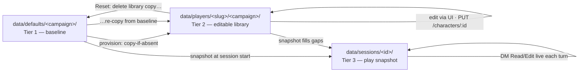
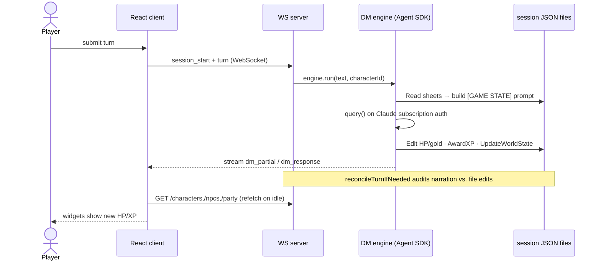
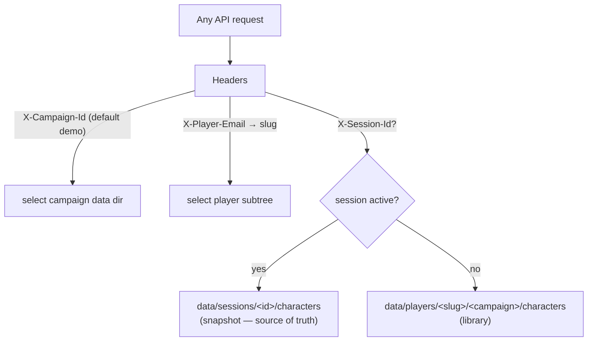

# D&D 5th Edition Companion App

A Node/Express + React (Vite) application for playing **Dungeons & Dragons 5e with an AI Dungeon Master**. The AI narrates the story, controls NPC companions, and adjudicates rules; the player manages their character(s) through the React UI. All game state lives as flat JSON files in `data/` — no database.

The DM runs on the [`@anthropic-ai/claude-agent-sdk`](https://www.npmjs.com/package/@anthropic-ai/claude-agent-sdk) using your Claude **subscription auth** (no `ANTHROPIC_API_KEY`), so DM turns bill against your Claude plan rather than API dollars.

- **Frontend** — React (Vite) in `client/`: character viewer/editor, NPC viewer, party roster, rules reference, the adventure/chat screen.
- **Backend** — Express API + WebSocket in `server/`: CRUD for characters, read-only NPCs/rules, and the DM engine.
- **Data** — JSON files in `data/`: the source of truth for all game state.

## Quickstart

```bash
npm install        # also installs client deps via postinstall
npm run dev        # server (:3001) + client (:5173) concurrently
```

Other scripts:

```bash
npm run server     # Express + WebSocket API only (port 3001)
npm run client     # Vite dev server only (port 5173)
npm test           # vitest
```

Then open http://localhost:5173. Game state is written straight to JSON under `data/` — you can inspect or hand-edit those files and the UI will reflect the changes on its next fetch.

## Architecture

### Character sheets: a three-tier storage model

Every character is a JSON file, but the *same* character can live in up to three tiers, each with a different job. The glue between tiers is one primitive — **copy-if-not-exists** (`server/player-data.js:53`) — so nothing ever clobbers a file that already exists downstream. That's what keeps your edits and each session's divergence intact.



| Tier | Path | Role | Mutated by |
|------|------|------|-----------|
| **Baseline** | `data/defaults/<campaign>/characters/` | Pristine template — the factory setting | Never touched by play |
| **Library** | `data/players/<slug>/<campaign>/characters/` | Your personal, editable copy | The character editor UI; reset |
| **Session snapshot** | `data/sessions/<id>/characters/` | Frozen play-state for one adventure | The DM, live, during play |

- **Provisioning** — on registration (and lazily on first read), `defaults/` is copied into `players/<you>/` for every campaign (`provisionAllCampaignDefaults`, `server/player-data.js:82`).
- **Editing** — the `CharacterEdit` form does `PUT /characters/:id`, overwriting your *library* JSON (`server/routes/characters.js:244`). Defaults are never affected.
- **Snapshotting** — starting a session copies defaults, then your library (filling gaps only), into the session dir (`snapshotToSession`, `server/player-data.js:118`).
- **Reset to baseline** — `POST /settings/reset-my-data` (`server/routes/settings.js:10`) deletes your library copies and re-copies from `defaults/`. The baseline is a real, untouched copy you can always fall back to.

NPCs share the character schema plus a `dmNotes` field (voice, secrets, motivations). `dmNotes` is stripped before NPC data is sent to the client (`server/routes/sessions.js`).

### Runtime turn flow

During play, the **session snapshot is the single source of truth** — the DM reads and edits `data/sessions/<id>/characters/` and `.../npcs/`, never your library or the defaults. Each turn, the current sheets are read fresh from disk and injected into a `[GAME STATE]` block in the prompt (`server/dm-engine.js:492`), with each entry stamped with its exact session file path so the DM knows what to `Edit` (`server/dm-engine.js:522`).



How the DM writes changes is a deliberate split:

- **HP, gold, equipment, consumables, death status** → the generic filesystem **`Edit`** tool editing the JSON directly. No special "HP tool."
- **XP** → dedicated tools only, `AwardXP` / `AwardPartyXP` (`server/dm-engine.js:683`), which also compute level and proficiency. Manual XP edits are forbidden by the prompt.
- **World state** (location, quests, events) → `UpdateWorldState`, merged into `session.json` (`server/dm-engine.js:880`).
- **Safety net** — after each turn, `reconcileTurnIfNeeded` (`server/ws-handler.js:45`) audits the DM's narration against the actual file edits; if it *said* HP dropped but didn't persist it, the DM is re-prompted to fix the file.

The client learns about changes by **refetching** — there's no WebSocket push of stat data. When a turn finishes (`thinking → idle`), the client re-pulls characters, NPCs, and the party (`client/src/pages/Adventure.jsx:433`), plus on window focus. That's why the DM must edit files immediately: the widgets read the files directly.

### Request scoping

Three headers on every request resolve exactly which files a read/write targets. The `X-Session-Id` header is the switch that flips reads between the library and the session snapshot (`getCharDir`, `server/routes/characters.js:62`).



Campaigns are fully isolated — `X-Campaign-Id` (default `demo`) selects the on-disk campaign directory (`server/campaign-context.js`), so `demo` and `campaign1` share zero state.

## Repo layout

```
client/            React (Vite) SPA
  src/api/client.js       REST wrapper + header injectors
  src/pages/              Adventure, CharacterDetail/Edit, CurrentParty, …
  src/hooks/useWebSocket.js   narrative/turn/dice streaming
server/            Express API + WebSocket + DM engine
  index.js                app entry (port 3001)
  ws-handler.js           WebSocket turn handling + reconcile
  dm-engine.js            prompt building + Agent SDK tools
  player-data.js          provisioning / reset / session snapshot
  xp-utils.js             XP award + party roster
  routes/                 characters, npcs, sessions, settings, …
data/              flat-file game state (source of truth)
  defaults/               baseline templates (per campaign)
  players/<slug>/          per-player editable libraries
  sessions/<id>/           per-session play snapshots
  campaigns/  rules/       scenario content + 5e rules database
```

## Further reading

- **`CLAUDE.md`** — the DM behavior guide (personality settings, dice integrity, post-encounter checklist, XP rules, chapter summaries).
- **`CHANGELOG.md`** — version history.
